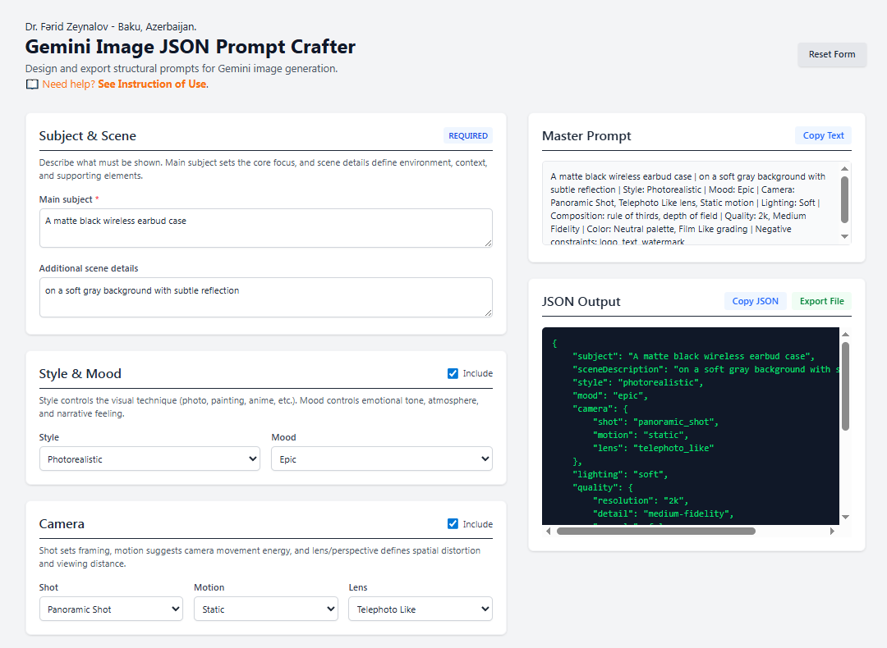
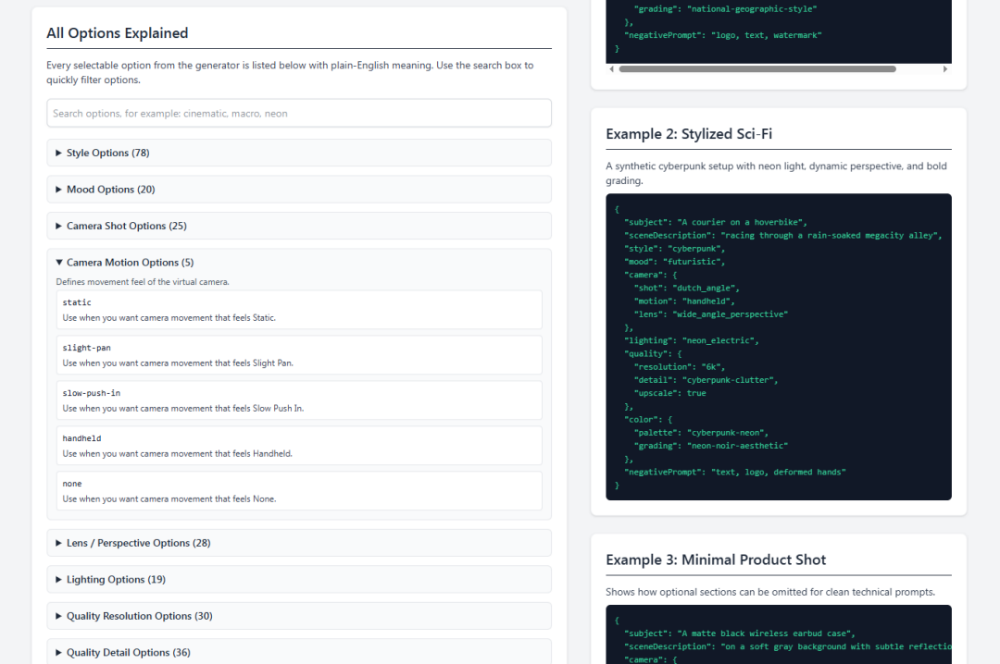

# 🌌 Gemini JSON Prompt Crafter

**The Ultimate Offline GUI for Structured AI Image Generation**

[]()
[]()
[]()
[]()
[]()
[]()

*Transform messy text prompts into deterministic, machine-readable JSON payloads ready for automated AI pipelines.*
Create high-quality **Gemini image prompts** with a clean UI and export them as **strict, structured JSON**.

This project is a privacy-first, browser-only prompt builder for creators, product teams, and prompt engineers who want reproducible, editable, and shareable image prompt configurations.

## Interface


## Why This Project

Most prompt tools generate plain text. This one is built around a different idea:

- **JSON-first prompt design** for predictable outputs and easier iteration.
- **No backend, no tracking, no account**. Works fully offline in your browser.
- **Beginner friendly UI** with guided sections, examples, and built-in validation warnings.
- **Portable artifact**. Save prompt configs as `.json`, version them in Git, reuse in teams.

If you care about repeatability and not losing prompt intent, structured JSON is a major upgrade.

## JSON Output Is The Core Feature

Every result is generated as a **JSON object** (not only a text paragraph). This is the key differentiator of the project.

Example output:

```json
{
  "subject": "An astronaut meditating on a cliff",
  "sceneDescription": "Sunrise over a fog-filled valley with distant floating islands",
  "style": "cinematic",
  "mood": "awe_inspiring",
  "camera": {
    "shot": "wide_angle_shot",
    "motion": "static",
    "lens": "wide_angle_perspective"
  },
  "lighting": "golden_hour",
  "composition": {
    "ruleOfThirds": true,
    "leadingLines": true,
    "depth": true
  },
  "quality": {
    "resolution": "4k",
    "detail": "high-fidelity",
    "upscale": true
  },
  "color": {
    "palette": "warm-tones",
    "grading": "cinematic-teal-and-orange"
  },
  "negativePrompt": "logo, watermark, text"
}
```

## Demo: Template Selection, Generated Prompt, JSON / Markdown Output



## Key Features

*   **📦 100% Native JSON Output**: The core philosophy of this tool. No more parsing strings. Get an instantly usable JSON object containing `subject`, `camera`, `lighting`, `color`, and `composition` parameters.
*   **🔌 Zero Dependencies & Fully Offline**: Runs entirely in your browser. No backend, no database, no node_modules. Perfect for air-gapped environments or local development.
*   **🛡️ Dynamic Conflict Validation**: Built-in logic checks prevent contradictory prompts. (e.g., The UI will warn you if you mix a "Macro Distance" lens with a "Panoramic" shot, or "Overcast" lighting with "Dramatic Shadows").
*   **🎛️ Modular Toggle System**: Include or exclude entire parameter sections (Style, Mood, Composition) with a single click. The JSON dynamically adapts, omitting empty objects.
*   **💾 Local Auto-Save**: Never lose your perfect prompt. The app continuously saves your state to `localStorage`.
*   **📋 One-Click Export**: Copy the JSON payload to your clipboard or download it as a `.json` file instantly.


## Who Is It For

- Prompt beginners who need guidance instead of blank text areas.
- Advanced users who want schema-like consistency.
- AI teams that share prompt recipes as JSON.
- Educators teaching prompt engineering with transparent structure.


## 🧱 Why JSON? (The Killer Feature)

Traditional text-to-image prompting relies on parsing long strings of comma-separated adjectives. This makes programmatic integration incredibly fragile.

**By outputting strictly structured JSON, this tool allows you to:**
1.  **Inject Variables Programmatically**: Easily map database fields (e.g., `user.favorite_color`) directly into the JSON `color.palette` key.
2.  **Maintain Version Control**: JSON prompts can be tracked in Git diffs cleanly.
3.  **Feed Automated Pipelines**: Send the generated JSON directly to Google Cloud Vertex API or custom Python/Node.js backend wrappers without string manipulation.


## Project Structure

```text
.
├── index.html         # Main application (offline, self-contained)
├── instruction.html   # Full user guide in the same visual style
└── README.md
```

## Quick Start

1. Clone the repository.
2. Open `index.html` in any modern browser.
3. Fill required and optional sections.
4. Copy JSON or export it as a file.

No installation, no build step, no server required.

## How To Use

1. Start with **Subject & Scene** (required).
2. Choose style and mood from curated options.
3. Configure camera and composition for framing intent.
4. Tune lighting, quality, and color grading.
5. Add `negativePrompt` to reduce unwanted artifacts.
6. Disable optional sections if you want a leaner JSON payload.
7. Export JSON and reuse it in your Gemini workflow.

For full documentation, open `instruction.html`.


## 🛠️ Tech Stack

*   **HTML5**: Semantic, accessible structure.
*   **Tailwind CSS (via CDN)**: Beautiful, responsive UI that works perfectly on desktop and mobile.
*   **Vanilla JavaScript (ES6)**: Fast, memory-efficient state management, DOM manipulation, and JSON schema validation without the React/Vue overhead.


## Design Principles

- **Offline-first**: works without internet after page load.
- **JSON over guesswork**: deterministic structure beats ad-hoc text.
- **Beginner-safe**: descriptions and warnings reduce common errors.
- **Open source by default**: easy to inspect, fork, customize.

## Performance & Stability

- Lightweight single-page architecture.
- No heavy dependencies, no framework runtime.
- Instant UI updates with minimal client-side processing.
- No network calls during prompt creation.

## SEO Keywords

Gemini prompt generator, image prompt JSON, structured prompt builder, offline AI prompt tool, Gemini image JSON prompt crafter, prompt engineering UI, browser prompt editor, no-code prompt generator.

## Roadmap

- Import existing JSON into the form.
- Preset packs for common visual styles.
- Multi-language UI.
- Optional schema validation report panel.
- Shareable URL-encoded prompt state.

## Contributing

Contributions are welcome.

1. Fork the repo.
2. Create a feature branch.
3. Make focused improvements.
4. Open a PR with before/after notes and screenshots.

## License

[](https://opensource.org/licenses/MIT)

<div align="center">
## Star This Project

[]()

If you find this tool helpful in your AI workflow and if this tool saves you time, please consider giving it a ⭐! It helps the project reach more creators and keeps open-source AI tooling thriving.
</div>
